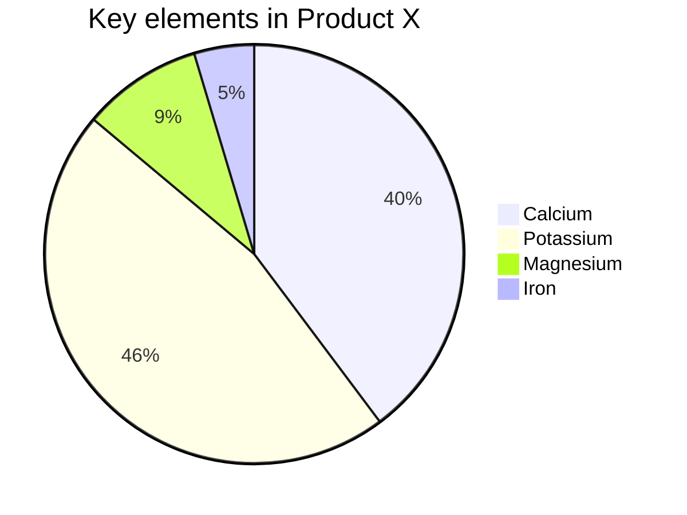

# 基本使用

## 图片


# 标签外挂

## 代码

```java
package com.laolang.bible.designpattern.simplefactory;

public class BusinessException extends RuntimeException {

    public BusinessException(String message) {
        super(message);
    }
}
```

## mermaid




## tabs



<!-- tab -->

**This is Tab 1.**

<!-- endtab -->

<!-- tab -->

**This is Tab 2.**

<!-- endtab -->

<!-- tab -->

**This is Tab 3.**

<!-- endtab -->




## label

臣亮言：创业未半，而。今天下三分，，此诚也！然侍衞之臣，不懈于内；，忘身于外者，盖追先帝之殊遇，欲报之于陛下也。诚宜开张圣听，以光先帝遗德，恢弘志士之气；不宜妄自菲薄，引喻失义，以塞忠谏之路也。
宫中、府中，俱为一体；陟罚臧否，不宜异同。若有、，及为忠善者，宜付有司，论其刑赏，以昭陛下平明之治；不宜偏私，使内外异法也。


## chartjs



<!-- chart -->
{
    "type": "line",
    "data": {
        "labels": ["January", "February", "March", "April", "May", "June", "July"],
        "datasets": [{
            "label": "My First dataset",
            "backgroundColor": "rgb(255, 99, 132)",
            "borderColor": "rgb(255, 99, 132)",
            "data": [0, 10, 5, 2, 20, 30, 45]
        }]
    },
    "options": {
        "responsive": true,
        "title": {
            "display": true,
            "text": "Chart.js Line Chart"
        }
    }
}
<!-- endchart -->




