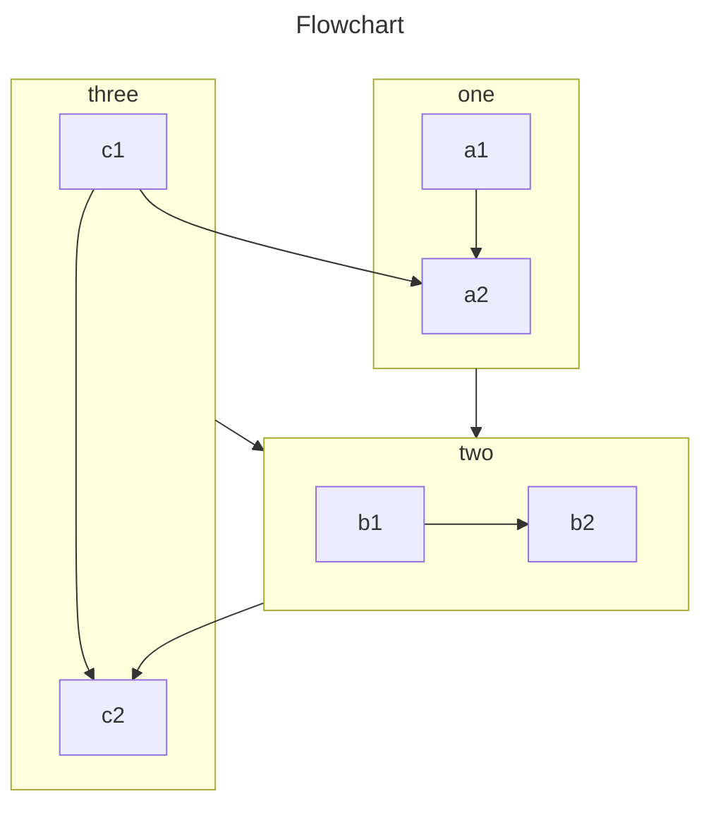

## 二级标题

### 三级标题

#### 四级标题

##### 五级标题

###### 六级标题


## 任务列表

- [ ] 未完成
- [x] 已完成


## 图片

基本使用


指定大小


## 内容

### 导入文件

<!-- @include: ./vuepress/content.md -->


### 脚注

脚注 1 链接[^first]。

脚注 2 链接[^second]。

行内的脚注^[行内脚注文本] 定义。

重复的页脚定义[^second]。


[^first]: 脚注 **可以包含特殊标记**

    也可以由多个段落组成

[^second]: 脚注文字。

### 选项卡

#### 基本使用

::: tabs

@tab 标题 1

<!-- tab 1 内容 -->

@tab 标题 2

<!-- tab 2 内容 -->

<!-- 👇 tab 3 将会被默认激活 -->

@tab:active 标题 3

<!-- tab 3 内容 -->

:::

#### 同步切换并保持选择

选择包管理器:

::: tabs#shell

@tab npm

npm 应该与 Node.js 被一同安装。

@tab pnpm

```bash
corepack enable
corepack use pnpm@latest
```

:::

安装 `vuepress`:

::: tabs#shell

@tab 使用 npm#npm

```bash
npm i -D vuepress
```

@tab 使用 pnpm#pnpm

```bash
pnpm add -D vuepress
```

:::


## 样式化

### 提示容器

#### 基本使用

::: important
重要容器。
:::

::: info
信息容器。
:::

::: note
注释容器。
:::

::: tip
提示容器
:::

::: warning
警告容器
:::

::: caution
危险容器
:::

::: details
详情容器
:::


#### 自定义标题

::: important 自定义标题

一个有 `代码` 和 [链接](#演示) 的重要容器。

```js
const a = 1;
```

:::

::: info 自定义标题

一个有 `代码` 和 [链接](#演示) 的信息容器。

```js
const a = 1;
```

:::

::: note 自定义标题

一个有 `代码` 和 [链接](#演示) 的注释容器。

```js
const a = 1;
```

:::

::: tip 自定义标题

一个有 `代码` 和 [链接](#演示) 的提示容器。

```js
const a = 1;
```

:::

::: warning 自定义标题

一个有 `代码` 和 [链接](#演示) 的警告容器。

```js
const a = 1;
```

:::

::: caution 自定义标题

一个有 `代码` 和 [链接](#演示) 的危险容器。

```js
const a = 1;
```

:::

::: details 自定义标题

一个有 `代码` 和 [链接](#演示) 的详情容器。

```js
const a = 1;
```

:::


#### 不含内容

::: important 自定义重要
:::

::: info 自定义信息
:::

::: note 自定义注释
:::

::: tip 自定义提示
:::

::: warning 自定义注意
:::

::: caution 自定义警告
:::


### GFM 警告

> [!important]
> 重要文字

> [!info]
> 信息文字

> [!tip]
> 提示文字

> [!warning]
> 注意文字

> [!caution]
> 警告文字

> [!note]
> 注释文字

### 标记

VuePress Theme Hope ==非常== 强大!

## 图表

### chartjs

#### 块状图

::: chartjs 一个块状图案例

```json
{
  "type": "bar",
  "data": {
    "labels": ["红色", "蓝色", "黄色", "绿色", "紫色", "橙色"],
    "datasets": [
      {
        "label": "投票数",
        "data": [12, 19, 3, 5, 2, 3],
        "backgroundColor": [
          "rgba(255, 99, 132, 0.2)",
          "rgba(54, 162, 235, 0.2)",
          "rgba(255, 206, 86, 0.2)",
          "rgba(75, 192, 192, 0.2)",
          "rgba(153, 102, 255, 0.2)",
          "rgba(255, 159, 64, 0.2)"
        ],
        "borderColor": [
          "rgba(255, 99, 132, 1)",
          "rgba(54, 162, 235, 1)",
          "rgba(255, 206, 86, 1)",
          "rgba(75, 192, 192, 1)",
          "rgba(153, 102, 255, 1)",
          "rgba(255, 159, 64, 1)"
        ],
        "borderWidth": 1
      }
    ]
  },
  "options": {
    "scales": {
      "y": {
        "beginAtZero": true
      }
    }
  }
}
```

:::


#### 气泡图

::: chartjs 一个气泡图案例

```json
{
  "type": "bubble",
  "data": {
    "datasets": [
      {
        "label": "第一个数据集",
        "data": [
          { "x": 20, "y": 30, "r": 15 },
          { "x": 40, "y": 10, "r": 10 }
        ],
        "backgroundColor": "rgb(255, 99, 132)"
      }
    ]
  }
}
```

:::


#### 线状图

::: chartjs 一个线状图案例

```json
{
  "type": "line",
  "data": {
    "labels": ["一月", "二月", "三月", "四月", "五月", "六月", "七月"],
    "datasets": [
      {
        "label": "我的第一个数据集",
        "data": [65, 59, 80, 81, 56, 55, 40],
        "fill": false,
        "borderColor": "rgb(75, 192, 192)",
        "tension": 0.1
      }
    ]
  }
}
```

:::


#### 玫瑰图

::: chartjs 一个玫瑰图案例

```json
{
  "type": "polarArea",
  "data": {
    "labels": ["红色", "绿色", "黄色", "灰色", "蓝色"],
    "datasets": [
      {
        "label": "我的第一个数据集",
        "data": [11, 16, 7, 3, 14],
        "backgroundColor": [
          "rgb(255, 99, 132)",
          "rgb(75, 192, 192)",
          "rgb(255, 205, 86)",
          "rgb(201, 203, 207)",
          "rgb(54, 162, 235)"
        ]
      }
    ]
  }
}
```

:::

#### 雷达图

::: chartjs 一个雷达图案例

```json
{
  "type": "radar",
  "data": {
    "labels": ["吃饭", "喝水", "睡觉", "设计", "编程", "骑车", "跑步"],
    "datasets": [
      {
        "label": "我的第一个数据集",
        "data": [65, 59, 90, 81, 56, 55, 40],
        "fill": true,
        "backgroundColor": "rgba(255, 99, 132, 0.2)",
        "borderColor": "rgb(255, 99, 132)",
        "pointBackgroundColor": "rgb(255, 99, 132)",
        "pointBorderColor": "#fff",
        "pointHoverBackgroundColor": "#fff",
        "pointHoverBorderColor": "rgb(255, 99, 132)"
      },
      {
        "label": "我的第二个数据集",
        "data": [28, 48, 40, 19, 96, 27, 100],
        "fill": true,
        "backgroundColor": "rgba(54, 162, 235, 0.2)",
        "borderColor": "rgb(54, 162, 235)",
        "pointBackgroundColor": "rgb(54, 162, 235)",
        "pointBorderColor": "#fff",
        "pointHoverBackgroundColor": "#fff",
        "pointHoverBorderColor": "rgb(54, 162, 235)"
      }
    ]
  },
  "options": {
    "elements": {
      "line": {
        "borderWidth": 3
      }
    }
  }
}
```

:::

#### 散点图

::: chartjs 一个散点图案例

```json
{
  "type": "scatter",
  "data": {
    "datasets": [
      {
        "label": "散点数据集",
        "data": [
          { "x": -10, "y": 0 },
          { "x": 0, "y": 10 },
          { "x": 10, "y": 5 },
          { "x": 0.5, "y": 5.5 }
        ],
        "backgroundColor": "rgb(255, 99, 132)"
      }
    ]
  },
  "options": {
    "scales": {
      "x": {
        "type": "linear",
        "position": "bottom"
      }
    }
  }
}
```

:::

### echarts

#### 线图

::: echarts Dynamic Data & Time Axis

```js
const oneDay = 86400000;
const data = [];
let now = new Date(1997, 9, 3);
let value = Math.random() * 1000;

const randomData = () => {
  now = new Date(+now + oneDay);
  value = value + Math.random() * 21 - 10;
  return {
    name: now.toString(),
    value: [
      [now.getFullYear(), now.getMonth() + 1, now.getDate()].join("/"),
      Math.round(value),
    ],
  };
};

for (let i = 0; i < 1000; i++) data.push(randomData());

const option = {
  tooltip: {
    trigger: "axis",
    formatter: function (params) {
      params = params[0];
      var date = new Date(params.name);
      return (
        date.getDate() +
        "/" +
        (date.getMonth() + 1) +
        "/" +
        date.getFullYear() +
        " : " +
        params.value[1]
      );
    },
    axisPointer: {
      animation: false,
    },
  },
  xAxis: {
    type: "time",
    splitLine: {
      show: false,
    },
  },
  yAxis: {
    type: "value",
    boundaryGap: [0, "100%"],
    splitLine: {
      show: false,
    },
  },
  toolbox: {
    show: true,
    feature: {
      mark: {
        show: true,
      },
      dataView: {
        show: true,
        readOnly: false,
      },
      restore: {
        show: true,
      },
      saveAsImage: {
        show: true,
      },
    },
  },
  series: [
    {
      name: "Fake Data",
      type: "line",
      showSymbol: false,
      data: data,
    },
  ],
};
const timeId = setInterval(() => {
  if (echarts._disposed) return clearInterval(timeId);

  for (let i = 0; i < 5; i++) {
    data.shift();
    data.push(randomData());
  }
  echarts.setOption({
    series: [
      {
        data: data,
      },
    ],
  });
}, 1000);
```

:::

#### 柱状图

::: echarts A bar chart

```js
const data = [];

for (let i = 0; i < 5; i++) data.push(Math.round(Math.random() * 200));

const option = {
  xAxis: {
    max: "dataMax",
  },
  yAxis: {
    type: "category",
    data: ["A", "B", "C", "D", "E"],
    inverse: true,
    animationDuration: 300,
    animationDurationUpdate: 300,
    max: 2, // only the largest 3 bars will be displayed
  },
  series: [
    {
      realtimeSort: true,
      name: "X",
      type: "bar",
      data: data,
      label: {
        show: true,
        position: "right",
        valueAnimation: true,
      },
    },
  ],
  legend: {
    show: true,
  },
  toolbox: {
    show: true,
    feature: {
      mark: {
        show: true,
      },
      dataView: {
        show: true,
        readOnly: false,
      },
      restore: {
        show: true,
      },
      saveAsImage: {
        show: true,
      },
    },
  },
  animationDuration: 0,
  animationDurationUpdate: 3000,
  animationEasing: "linear",
  animationEasingUpdate: "linear",
};
const run = () => {
  for (let i = 0; i < data.length; i++)
    data[i] += Math.round(Math.random() * Math.random() > 0.9 ? 2000 : 200);

  echarts.setOption({
    series: [{ type: "bar", data }],
  });
};

const timeId = setInterval(() => {
  if (echarts._disposed) return clearInterval(timeId);

  run();
}, 3000);
```

:::

饼图

::: echarts A nightingale chart

```json
{
  "legend": {
    "top": "bottom"
  },
  "toolbox": {
    "show": true,
    "feature": {
      "mark": {
        "show": true
      },
      "dataView": {
        "show": true,
        "readOnly": false
      },
      "restore": {
        "show": true
      },
      "saveAsImage": {
        "show": true
      }
    }
  },
  "series": [
    {
      "name": "Nightingale Chart",
      "type": "pie",
      "radius": [20, 100],
      "center": ["50%", "50%"],
      "roseType": "area",
      "itemStyle": {
        "borderRadius": 8
      },
      "data": [
        {
          "value": 40,
          "name": "rose 1"
        },
        {
          "value": 38,
          "name": "rose 2"
        },
        {
          "value": 32,
          "name": "rose 3"
        },
        {
          "value": 30,
          "name": "rose 4"
        },
        {
          "value": 28,
          "name": "rose 5"
        },
        {
          "value": 26,
          "name": "rose 6"
        },
        {
          "value": 22,
          "name": "rose 7"
        },
        {
          "value": 18,
          "name": "rose 8"
        }
      ]
    }
  ]
}
```

:::

#### 散点图


::: echarts A scatter chart

```json
{
  "xAxis": {},
  "yAxis": {},
  "series": [
    {
      "symbolSize": 20,
      "data": [
        [10.0, 8.04],
        [8.07, 6.95],
        [13.0, 7.58],
        [9.05, 8.81],
        [11.0, 8.33],
        [14.0, 7.66],
        [13.4, 6.81],
        [10.0, 6.33],
        [14.0, 8.96],
        [12.5, 6.82],
        [9.15, 7.2],
        [11.5, 7.2],
        [3.03, 4.23],
        [12.2, 7.83],
        [2.02, 4.47],
        [1.05, 3.33],
        [4.05, 4.96],
        [6.03, 7.24],
        [12.0, 6.26],
        [12.0, 8.84],
        [7.08, 5.82],
        [5.02, 5.68]
      ],
      "type": "scatter"
    }
  ]
}
```

:::

#### 极坐标图

::: echarts Two Value-Axes in Polar

```js
const data = [];

for (let i = 0; i <= 100; i++) {
  let theta = (i / 100) * 360;
  let r = 5 * (1 + Math.sin((theta / 180) * Math.PI));
  data.push([r, theta]);
}

const height = 450;

const option = {
  legend: {
    data: ["line"],
  },
  polar: {},
  tooltip: {
    trigger: "axis",
    axisPointer: {
      type: "cross",
    },
  },
  angleAxis: {
    type: "value",
    startAngle: 0,
  },
  radiusAxis: {},
  series: [
    {
      coordinateSystem: "polar",
      name: "line",
      type: "line",
      data: data,
    },
  ],
};
```

:::

#### 烛台图

::: echarts Stocks

```js
const upColor = "#ec0000";
const upBorderColor = "#8A0000";
const downColor = "#00da3c";
const downBorderColor = "#008F28";

const splitData = (rawData) => {
  const categoryData = [];
  const values = [];

  for (let i = 0; i < rawData.length; i++) {
    categoryData.push(rawData[i].splice(0, 1)[0]);
    values.push(rawData[i]);
  }

  return {
    categoryData: categoryData,
    values: values,
  };
};

// Each item: open，close，lowest，highest
const data0 = splitData([
  ["2013/1/24", 2320.26, 2320.26, 2287.3, 2362.94],
  ["2013/1/25", 2300, 2291.3, 2288.26, 2308.38],
  ["2013/1/28", 2295.35, 2346.5, 2295.35, 2346.92],
  ["2013/1/29", 2347.22, 2358.98, 2337.35, 2363.8],
  ["2013/1/30", 2360.75, 2382.48, 2347.89, 2383.76],
  ["2013/1/31", 2383.43, 2385.42, 2371.23, 2391.82],
  ["2013/2/1", 2377.41, 2419.02, 2369.57, 2421.15],
  ["2013/2/4", 2425.92, 2428.15, 2417.58, 2440.38],
  ["2013/2/5", 2411, 2433.13, 2403.3, 2437.42],
  ["2013/2/6", 2432.68, 2434.48, 2427.7, 2441.73],
  ["2013/2/7", 2430.69, 2418.53, 2394.22, 2433.89],
  ["2013/2/8", 2416.62, 2432.4, 2414.4, 2443.03],
  ["2013/2/18", 2441.91, 2421.56, 2415.43, 2444.8],
  ["2013/2/19", 2420.26, 2382.91, 2373.53, 2427.07],
  ["2013/2/20", 2383.49, 2397.18, 2370.61, 2397.94],
  ["2013/2/21", 2378.82, 2325.95, 2309.17, 2378.82],
  ["2013/2/22", 2322.94, 2314.16, 2308.76, 2330.88],
  ["2013/2/25", 2320.62, 2325.82, 2315.01, 2338.78],
  ["2013/2/26", 2313.74, 2293.34, 2289.89, 2340.71],
  ["2013/2/27", 2297.77, 2313.22, 2292.03, 2324.63],
  ["2013/2/28", 2322.32, 2365.59, 2308.92, 2366.16],
  ["2013/3/1", 2364.54, 2359.51, 2330.86, 2369.65],
  ["2013/3/4", 2332.08, 2273.4, 2259.25, 2333.54],
  ["2013/3/5", 2274.81, 2326.31, 2270.1, 2328.14],
  ["2013/3/6", 2333.61, 2347.18, 2321.6, 2351.44],
  ["2013/3/7", 2340.44, 2324.29, 2304.27, 2352.02],
  ["2013/3/8", 2326.42, 2318.61, 2314.59, 2333.67],
  ["2013/3/11", 2314.68, 2310.59, 2296.58, 2320.96],
  ["2013/3/12", 2309.16, 2286.6, 2264.83, 2333.29],
  ["2013/3/13", 2282.17, 2263.97, 2253.25, 2286.33],
  ["2013/3/14", 2255.77, 2270.28, 2253.31, 2276.22],
  ["2013/3/15", 2269.31, 2278.4, 2250, 2312.08],
  ["2013/3/18", 2267.29, 2240.02, 2239.21, 2276.05],
  ["2013/3/19", 2244.26, 2257.43, 2232.02, 2261.31],
  ["2013/3/20", 2257.74, 2317.37, 2257.42, 2317.86],
  ["2013/3/21", 2318.21, 2324.24, 2311.6, 2330.81],
  ["2013/3/22", 2321.4, 2328.28, 2314.97, 2332],
  ["2013/3/25", 2334.74, 2326.72, 2319.91, 2344.89],
  ["2013/3/26", 2318.58, 2297.67, 2281.12, 2319.99],
  ["2013/3/27", 2299.38, 2301.26, 2289, 2323.48],
  ["2013/3/28", 2273.55, 2236.3, 2232.91, 2273.55],
  ["2013/3/29", 2238.49, 2236.62, 2228.81, 2246.87],
  ["2013/4/1", 2229.46, 2234.4, 2227.31, 2243.95],
  ["2013/4/2", 2234.9, 2227.74, 2220.44, 2253.42],
  ["2013/4/3", 2232.69, 2225.29, 2217.25, 2241.34],
  ["2013/4/8", 2196.24, 2211.59, 2180.67, 2212.59],
  ["2013/4/9", 2215.47, 2225.77, 2215.47, 2234.73],
  ["2013/4/10", 2224.93, 2226.13, 2212.56, 2233.04],
  ["2013/4/11", 2236.98, 2219.55, 2217.26, 2242.48],
  ["2013/4/12", 2218.09, 2206.78, 2204.44, 2226.26],
  ["2013/4/15", 2199.91, 2181.94, 2177.39, 2204.99],
  ["2013/4/16", 2169.63, 2194.85, 2165.78, 2196.43],
  ["2013/4/17", 2195.03, 2193.8, 2178.47, 2197.51],
  ["2013/4/18", 2181.82, 2197.6, 2175.44, 2206.03],
  ["2013/4/19", 2201.12, 2244.64, 2200.58, 2250.11],
  ["2013/4/22", 2236.4, 2242.17, 2232.26, 2245.12],
  ["2013/4/23", 2242.62, 2184.54, 2182.81, 2242.62],
  ["2013/4/24", 2187.35, 2218.32, 2184.11, 2226.12],
  ["2013/4/25", 2213.19, 2199.31, 2191.85, 2224.63],
  ["2013/4/26", 2203.89, 2177.91, 2173.86, 2210.58],
  ["2013/5/2", 2170.78, 2174.12, 2161.14, 2179.65],
  ["2013/5/3", 2179.05, 2205.5, 2179.05, 2222.81],
  ["2013/5/6", 2212.5, 2231.17, 2212.5, 2236.07],
  ["2013/5/7", 2227.86, 2235.57, 2219.44, 2240.26],
  ["2013/5/8", 2242.39, 2246.3, 2235.42, 2255.21],
  ["2013/5/9", 2246.96, 2232.97, 2221.38, 2247.86],
  ["2013/5/10", 2228.82, 2246.83, 2225.81, 2247.67],
  ["2013/5/13", 2247.68, 2241.92, 2231.36, 2250.85],
  ["2013/5/14", 2238.9, 2217.01, 2205.87, 2239.93],
  ["2013/5/15", 2217.09, 2224.8, 2213.58, 2225.19],
  ["2013/5/16", 2221.34, 2251.81, 2210.77, 2252.87],
  ["2013/5/17", 2249.81, 2282.87, 2248.41, 2288.09],
  ["2013/5/20", 2286.33, 2299.99, 2281.9, 2309.39],
  ["2013/5/21", 2297.11, 2305.11, 2290.12, 2305.3],
  ["2013/5/22", 2303.75, 2302.4, 2292.43, 2314.18],
  ["2013/5/23", 2293.81, 2275.67, 2274.1, 2304.95],
  ["2013/5/24", 2281.45, 2288.53, 2270.25, 2292.59],
  ["2013/5/27", 2286.66, 2293.08, 2283.94, 2301.7],
  ["2013/5/28", 2293.4, 2321.32, 2281.47, 2322.1],
  ["2013/5/29", 2323.54, 2324.02, 2321.17, 2334.33],
  ["2013/5/30", 2316.25, 2317.75, 2310.49, 2325.72],
  ["2013/5/31", 2320.74, 2300.59, 2299.37, 2325.53],
  ["2013/6/3", 2300.21, 2299.25, 2294.11, 2313.43],
  ["2013/6/4", 2297.1, 2272.42, 2264.76, 2297.1],
  ["2013/6/5", 2270.71, 2270.93, 2260.87, 2276.86],
  ["2013/6/6", 2264.43, 2242.11, 2240.07, 2266.69],
  ["2013/6/7", 2242.26, 2210.9, 2205.07, 2250.63],
  ["2013/6/13", 2190.1, 2148.35, 2126.22, 2190.1],
]);

const calculateMA = (dayCount) => {
  const result = [];

  for (let i = 0; i < data0.values.length; i++) {
    if (i < dayCount) {
      result.push("-");
      continue;
    }
    let sum = 0;

    for (let j = 0; j < dayCount; j++) sum += +data0.values[i - j][1];

    result.push(sum / dayCount);
  }

  return result;
};
const option = {
  tooltip: {
    trigger: "axis",
    axisPointer: {
      type: "cross",
    },
  },
  legend: {
    data: ["日K", "MA5", "MA10", "MA20", "MA30"],
  },
  grid: {
    left: "10%",
    right: "10%",
    bottom: "15%",
  },
  xAxis: {
    type: "category",
    data: data0.categoryData,
    boundaryGap: false,
    axisLine: { onZero: false },
    splitLine: { show: false },
    min: "dataMin",
    max: "dataMax",
  },
  yAxis: {
    scale: true,
    splitArea: {
      show: true,
    },
  },
  dataZoom: [
    {
      type: "inside",
      start: 50,
      end: 100,
    },
    {
      show: true,
      type: "slider",
      top: "90%",
      start: 50,
      end: 100,
    },
  ],
  series: [
    {
      name: "日K",
      type: "candlestick",
      data: data0.values,
      itemStyle: {
        color: upColor,
        color0: downColor,
        borderColor: upBorderColor,
        borderColor0: downBorderColor,
      },
      markPoint: {
        label: {
          formatter: (param) =>
            param == null ? "" : Math.round(param.value).toString(),
        },
        data: [
          {
            name: "Mark",
            coord: ["2013/5/31", 2300],
            value: 2300,
            itemStyle: {
              color: "rgb(41,60,85)",
            },
          },
          {
            name: "highest value",
            type: "max",
            valueDim: "highest",
          },
          {
            name: "lowest value",
            type: "min",
            valueDim: "lowest",
          },
          {
            name: "average value on close",
            type: "average",
            valueDim: "close",
          },
        ],
        tooltip: {
          formatter: (param) => param.name + "<br>" + (param.data.coord || ""),
        },
      },
      markLine: {
        symbol: ["none", "none"],
        data: [
          [
            {
              name: "from lowest to highest",
              type: "min",
              valueDim: "lowest",
              symbol: "circle",
              symbolSize: 10,
              label: {
                show: false,
              },
              emphasis: {
                label: {
                  show: false,
                },
              },
            },
            {
              type: "max",
              valueDim: "highest",
              symbol: "circle",
              symbolSize: 10,
              label: {
                show: false,
              },
              emphasis: {
                label: {
                  show: false,
                },
              },
            },
          ],
          {
            name: "min line on close",
            type: "min",
            valueDim: "close",
          },
          {
            name: "max line on close",
            type: "max",
            valueDim: "close",
          },
        ],
      },
    },
    {
      name: "MA5",
      type: "line",
      data: calculateMA(5),
      smooth: true,
      lineStyle: {
        opacity: 0.5,
      },
    },
    {
      name: "MA10",
      type: "line",
      data: calculateMA(10),
      smooth: true,
      lineStyle: {
        opacity: 0.5,
      },
    },
    {
      name: "MA20",
      type: "line",
      data: calculateMA(20),
      smooth: true,
      lineStyle: {
        opacity: 0.5,
      },
    },
    {
      name: "MA30",
      type: "line",
      data: calculateMA(30),
      smooth: true,
      lineStyle: {
        opacity: 0.5,
      },
    },
  ],
};
```

:::

#### 雷达图

::: echarts A Radar Chart

```json
{
  "legend": {
    "data": ["Allocated Budget", "Actual Spending"]
  },
  "radar": {
    "indicator": [
      { "name": "Sales", "max": 6500 },
      { "name": "Administration", "max": 16000 },
      { "name": "Information Technology", "max": 30000 },
      { "name": "Customer Support", "max": 38000 },
      { "name": "Development", "max": 52000 },
      { "name": "Marketing", "max": 25000 }
    ]
  },
  "series": [
    {
      "name": "Budget vs spending",
      "type": "radar",
      "data": [
        {
          "value": [4200, 3000, 20000, 35000, 50000, 18000],
          "name": "Allocated Budget"
        },
        {
          "value": [5000, 14000, 28000, 26000, 42000, 21000],
          "name": "Actual Spending"
        }
      ]
    }
  ]
}
```

:::

#### 热力图

::: echarts

```js
///////////////////////////////////////////////////////////////////////////
// perlin noise helper from https://github.com/josephg/noisejs
///////////////////////////////////////////////////////////////////////////
function getNoiseHelper() {
  class Grad {
    constructor(x, y, z) {
      this.x = x;
      this.y = y;
      this.z = z;
    }
    dot2(x, y) {
      return this.x * x + this.y * y;
    }
    dot3(x, y, z) {
      return this.x * x + this.y * y + this.z * z;
    }
  }
  const grad3 = [
    new Grad(1, 1, 0),
    new Grad(-1, 1, 0),
    new Grad(1, -1, 0),
    new Grad(-1, -1, 0),
    new Grad(1, 0, 1),
    new Grad(-1, 0, 1),
    new Grad(1, 0, -1),
    new Grad(-1, 0, -1),
    new Grad(0, 1, 1),
    new Grad(0, -1, 1),
    new Grad(0, 1, -1),
    new Grad(0, -1, -1),
  ];
  const p = [
    151, 160, 137, 91, 90, 15, 131, 13, 201, 95, 96, 53, 194, 233, 7, 225, 140,
    36, 103, 30, 69, 142, 8, 99, 37, 240, 21, 10, 23, 190, 6, 148, 247, 120,
    234, 75, 0, 26, 197, 62, 94, 252, 219, 203, 117, 35, 11, 32, 57, 177, 33,
    88, 237, 149, 56, 87, 174, 20, 125, 136, 171, 168, 68, 175, 74, 165, 71,
    134, 139, 48, 27, 166, 77, 146, 158, 231, 83, 111, 229, 122, 60, 211, 133,
    230, 220, 105, 92, 41, 55, 46, 245, 40, 244, 102, 143, 54, 65, 25, 63, 161,
    1, 216, 80, 73, 209, 76, 132, 187, 208, 89, 18, 169, 200, 196, 135, 130,
    116, 188, 159, 86, 164, 100, 109, 198, 173, 186, 3, 64, 52, 217, 226, 250,
    124, 123, 5, 202, 38, 147, 118, 126, 255, 82, 85, 212, 207, 206, 59, 227,
    47, 16, 58, 17, 182, 189, 28, 42, 223, 183, 170, 213, 119, 248, 152, 2, 44,
    154, 163, 70, 221, 153, 101, 155, 167, 43, 172, 9, 129, 22, 39, 253, 19, 98,
    108, 110, 79, 113, 224, 232, 178, 185, 112, 104, 218, 246, 97, 228, 251, 34,
    242, 193, 238, 210, 144, 12, 191, 179, 162, 241, 81, 51, 145, 235, 249, 14,
    239, 107, 49, 192, 214, 31, 181, 199, 106, 157, 184, 84, 204, 176, 115, 121,
    50, 45, 127, 4, 150, 254, 138, 236, 205, 93, 222, 114, 67, 29, 24, 72, 243,
    141, 128, 195, 78, 66, 215, 61, 156, 180,
  ];
  // To remove the need for index wrapping, double the permutation table length
  let perm = new Array(512);
  let gradP = new Array(512);
  // This isn't a very good seeding function, but it works ok. It supports 2^16
  // different seed values. Write something better if you need more seeds.
  function seed(seed) {
    if (seed > 0 && seed < 1) {
      // Scale the seed out
      seed *= 65536;
    }
    seed = Math.floor(seed);
    if (seed < 256) {
      seed |= seed << 8;
    }
    for (let i = 0; i < 256; i++) {
      let v;
      if (i & 1) {
        v = p[i] ^ (seed & 255);
      } else {
        v = p[i] ^ ((seed >> 8) & 255);
      }
      perm[i] = perm[i + 256] = v;
      gradP[i] = gradP[i + 256] = grad3[v % 12];
    }
  }
  seed(0);
  // ##### Perlin noise stuff
  function fade(t) {
    return t * t * t * (t * (t * 6 - 15) + 10);
  }
  function lerp(a, b, t) {
    return (1 - t) * a + t * b;
  }
  // 2D Perlin Noise
  function perlin2(x, y) {
    // Find unit grid cell containing point
    let X = Math.floor(x),
      Y = Math.floor(y);
    // Get relative xy coordinates of point within that cell
    x = x - X;
    y = y - Y;
    // Wrap the integer cells at 255 (smaller integer period can be introduced here)
    X = X & 255;
    Y = Y & 255;
    // Calculate noise contributions from each of the four corners
    let n00 = gradP[X + perm[Y]].dot2(x, y);
    let n01 = gradP[X + perm[Y + 1]].dot2(x, y - 1);
    let n10 = gradP[X + 1 + perm[Y]].dot2(x - 1, y);
    let n11 = gradP[X + 1 + perm[Y + 1]].dot2(x - 1, y - 1);
    // Compute the fade curve value for x
    let u = fade(x);
    // Interpolate the four results
    return lerp(lerp(n00, n10, u), lerp(n01, n11, u), fade(y));
  }
  return {
    seed,
    perlin2,
  };
}

let noise = getNoiseHelper();
let xData = [];
let yData = [];
noise.seed(Math.random());

let data = [];
for (let i = 0; i <= 200; i++) {
  for (let j = 0; j <= 100; j++) {
    data.push([i, j, noise.perlin2(i / 40, j / 20) + 0.5]);
  }
  xData.push(i);
}
for (let j = 0; j < 100; j++) {
  yData.push(j);
}

option = {
  tooltip: {},
  xAxis: {
    type: "category",
    data: xData,
  },
  yAxis: {
    type: "category",
    data: yData,
  },
  visualMap: {
    min: 0,
    max: 1,
    calculable: true,
    realtime: false,
    inRange: {
      color: [
        "#313695",
        "#4575b4",
        "#74add1",
        "#abd9e9",
        "#e0f3f8",
        "#ffffbf",
        "#fee090",
        "#fdae61",
        "#f46d43",
        "#d73027",
        "#a50026",
      ],
    },
  },
  series: [
    {
      name: "Gaussian",
      type: "heatmap",
      data: data,
      emphasis: {
        itemStyle: {
          borderColor: "#333",
          borderWidth: 1,
        },
      },
      progressive: 1000,
      animation: false,
    },
  ],
};

const height = 500;
```

:::

#### 树图

::: echarts Tree

```js
const data = await fetch(
  "https://theme-hope-assets.vuejs.press/data/flare.json",
).then((res) => res.json());

const option = {
  tooltip: {
    trigger: "item",
    triggerOn: "mousemove",
  },
  series: [
    {
      type: "tree",
      data: [data],
      top: "18%",
      bottom: "14%",
      layout: "radial",
      symbol: "emptyCircle",
      symbolSize: 7,
      initialTreeDepth: 3,
      animationDurationUpdate: 750,
      emphasis: {
        focus: "descendant",
      },
    },
  ],
};

const height = 600;
```

:::

#### 多图

::: echarts

```js
const option = {
  legend: {},
  tooltip: {
    trigger: "axis",
    showContent: false,
  },
  dataset: {
    source: [
      ["product", "2012", "2013", "2014", "2015", "2016", "2017"],
      ["Milk Tea", 56.5, 82.1, 88.7, 70.1, 53.4, 85.1],
      ["Matcha Latte", 51.1, 51.4, 55.1, 53.3, 73.8, 68.7],
      ["Cheese Cocoa", 40.1, 62.2, 69.5, 36.4, 45.2, 32.5],
      ["Walnut Brownie", 25.2, 37.1, 41.2, 18, 33.9, 49.1],
    ],
  },
  xAxis: { type: "category" },
  yAxis: { gridIndex: 0 },
  grid: { top: "55%" },
  series: [
    {
      type: "line",
      smooth: true,
      seriesLayoutBy: "row",
      emphasis: { focus: "series" },
    },
    {
      type: "line",
      smooth: true,
      seriesLayoutBy: "row",
      emphasis: { focus: "series" },
    },
    {
      type: "line",
      smooth: true,
      seriesLayoutBy: "row",
      emphasis: { focus: "series" },
    },
    {
      type: "line",
      smooth: true,
      seriesLayoutBy: "row",
      emphasis: { focus: "series" },
    },
    {
      type: "pie",
      id: "pie",
      radius: "30%",
      center: ["50%", "25%"],
      emphasis: {
        focus: "self",
      },
      label: {
        formatter: "{b}: {@2012} ({d}%)",
      },
      encode: {
        itemName: "product",
        value: "2012",
        tooltip: "2012",
      },
    },
  ],
};

const height = 800;
```

:::

#### 词云

::: echarts

```js
const option = {
  // canvas background color
  backgroundColor: "#ffa",
  // The mouse pointer hangs to display the value
  tooltip: {},
  series: [
    {
      type: "wordCloud",

      // The shape of the "cloud" to draw. Can be any polar equation represented as a
      // callback function, or a keyword present. Available presents are circle (default),
      // cardioid (apple or heart shape curve, the most known polar equation), diamond (
      // alias of square), triangle-forward, triangle, (alias of triangle-upright, pentagon, and star.

      shape: "circle",

      // Keep aspect ratio of maskImage or 1:1 for shapes
      // This option is supported since echarts-wordcloud@2.1.0
      keepAspect: false,

      // A silhouette image which the white area will be excluded from drawing texts.
      // The shape option will continue to apply as the shape of the cloud to grow.

      // maskImage: maskImage,

      // Following left/top/width/height/right/bottom are used for positioning the word cloud
      // Default to be put in the center and has 75% x 80% size.

      left: "center",
      top: "center",
      width: "70%",
      height: "80%",
      right: null,
      bottom: null,

      // Text size range which the value in data will be mapped to.
      // Default to have minimum 12px and maximum 60px size.

      sizeRange: [12, 60],

      // Text rotation range and step in degree. Text will be rotated randomly in range [-90, 90] by rotationStep 45

      rotationRange: [-90, 90],
      rotationStep: 45,

      // size of the grid in pixels for marking the availability of the canvas
      // the larger the grid size, the bigger the gap between words.

      gridSize: 8,

      // set to true to allow word to be drawn partly outside of the canvas.
      // Allow word bigger than the size of the canvas to be drawn
      // This option is supported since echarts-wordcloud@2.1.0
      drawOutOfBound: false,

      // if the font size is too large for the text to be displayed,
      // whether to shrink the text. If it is set to false, the text will
      // not be rendered. If it is set to true, the text will be shrinked.
      // This option is supported since echarts-wordcloud@2.1.0
      shrinkToFit: false,

      // If perform layout animation.
      // NOTE disable it will lead to UI blocking when there is lots of words.
      layoutAnimation: true,

      // Global text style
      textStyle: {
        fontFamily: "sans-serif",
        fontWeight: "bold",
        // Color can be a callback function or a color string
        color: function () {
          // Random color
          return (
            "rgb(" +
            [
              Math.round(Math.random() * 160),
              Math.round(Math.random() * 160),
              Math.round(Math.random() * 160),
            ].join(",") +
            ")"
          );
        },
      },
      emphasis: {
        focus: "self",

        textStyle: {
          textShadowBlur: 10,
          textShadowColor: "#333",
        },
      },

      // Data is an array. Each array item must have name and value property.
      // textStyle must not be empty
      data: [
        {
          name: "vuepress theme hope",
          value: 8888,
          // Style of single text
          //textStyle: {},
        },
        {
          name: "Mr.Hope",
          value: 10000,
          textStyle: {
            color: "black",
          },
          emphasis: {
            textStyle: {
              color: "#BDBEFA",
              shadowBlur: 4,
              shadowOffsetY: 14,
            },
          },
        },
      ],
    },
  ],
};
```

:::


### mermaid

#### 流程图



#### 循序图

```sequence Greetings
Alice ->> Bob: Hello Bob, how are you?
Bob-->>John: How about you John?
Bob--x Alice: I am good thanks!
Bob-x John: I am good thanks!
Note right of John: Bob thinks a long<br/>long time, so long<br/>that the text does<br/>not fit on a row.

Bob-->Alice: Checking with John...
Alice->John: Yes... John, how are you?
```

#### 类图

```class Animal Example
note "From Duck till Zebra"
Animal <|-- Duck
note for Duck "can fly\ncan swim\ncan dive\ncan help in debugging"
Animal <|-- Fish
Animal <|-- Zebra
Animal : +int age
Animal : +String gender
Animal: +isMammal()
Animal: +mate()
class Duck{
  +String beakColor
  +swim()
  +quack()
}
class Fish{
  -int sizeInFeet
  -canEat()
}
class Zebra{
  +bool is_wild
  +run()
}
```

#### 状态图

```state Check if n is negative

state if_state <<choice>>
[*] --> IsPositive
IsPositive --> if_state
if_state --> False: if n < 0
if_state --> True : if n >= 0
```

#### 关系图

```er Er Example
CAR ||--o{ NAMED-DRIVER : allows
CAR {
    string registrationNumber
    string make
    string model
}
PERSON ||--o{ NAMED-DRIVER : is
PERSON {
    string firstName
    string lastName
    int age
}
```

#### 甘特图

```gantt
dateFormat  YYYY-MM-DD
title       Adding GANTT diagram functionality to mermaid
excludes    weekends
%% (`excludes` accepts specific dates in YYYY-MM-DD format, days of the week ("sunday") or "weekends", but not the word "weekdays".)

section A section
Completed task            :done,    des1, 2014-01-06,2014-01-08
Active task               :active,  des2, 2014-01-09, 3d
Future task               :         des3, after des2, 5d
Future task2              :         des4, after des3, 5d

section Critical tasks
Completed task in the critical line :crit, done, 2014-01-06,24h
Implement parser                    :crit, done, after des1, 2d
Create tests for parser             :crit, active, 3d
Future task in critical line        :crit, 5d
Create tests for renderer           :2d
Add to mermaid                      :1d

section Documentation
Describe gantt syntax               :active, a1, after des1, 3d
Add gantt diagram to demo page      :after a1  , 20h
Add another diagram to demo page    :doc1, after a1  , 48h

section Last section
Describe gantt syntax               :after doc1, 3d
Add gantt diagram to demo page      :20h
Add another diagram to demo page    :48h
```


#### git 图表

```git-graph
commit
branch hotfix
checkout hotfix
commit
branch develop
checkout develop
commit id:"ash" tag:"abc"
branch featureB
checkout featureB
commit type:HIGHLIGHT
checkout main
checkout hotfix
commit type:NORMAL
checkout develop
commit type:REVERSE
checkout featureB
commit
checkout main
merge hotfix
checkout featureB
commit
checkout develop
branch featureA
commit
checkout develop
merge hotfix
checkout featureA
commit
checkout featureB
commit
checkout develop
merge featureA
branch release
checkout release
commit
checkout main
commit
checkout release
merge main
checkout develop
merge release
```

### plantuml

#### 类图

@startuml
abstract class AbstractList
abstract AbstractCollection
interface List
interface Collection

List <|-- AbstractList
Collection <|-- AbstractCollection

Collection <|- List
AbstractCollection <|- AbstractList
AbstractList <|-- ArrayList

class ArrayList {
  Object[] elementData
  size()
}

enum TimeUnit {
  DAYS
  HOURS
  MINUTES
}

annotation SuppressWarnings

annotation Annotation {
  annotation with members
  String foo()
  String bar()
}
@enduml

### 思维导图

````markmap
---
markmap:
  colorFreezeLevel: 2
---

# markmap

## 链接

- <https://markmap.js.org/>
- [GitHub](https://github.com/markmap/markmap)

## 功能

- 链接
- **强调** ~~删除线~~ *斜体* ==高亮==
- 多行
  文字
- `行内代码`
-
    ```js
    console.log('code block');
    ```
- Katex
  - $x = {-b \pm \sqrt{b^2-4ac} \over 2a}$
- 现在我们可以通过 `maxWidth` 选项自动换行非常非常非常非常非常非常非常非常非常非常长的内容
````

### 流程图

#### vue 主题

```flow
st=>start: 开始|past:>http://www.google.com[blank]
e=>end: 结束|future:>http://www.google.com
op1=>operation: 操作1|past
op2=>operation: 操作2|current
sub1=>subroutine: 子程序|invalid
cond=>condition: 是/否?|approved:>http://www.google.com
c2=>condition: 判断2|rejected
io=>inputoutput: 进行反思...|future

st->op1(right)->cond
cond(yes, right)->c2
cond(no)->sub1(left)->op1
c2(yes)->io->e
c2(no)->op2->e
```

#### ant 主题

```flow:ant
st=>start: 开始|past:>http://www.google.com[blank]
e=>end: 结束|future:>http://www.google.com
op1=>operation: 操作1|past
op2=>operation: 操作2|current
sub1=>subroutine: 子程序|invalid
cond=>condition: 是/否?|approved:>http://www.google.com
c2=>condition: 判断2|rejected
io=>inputoutput: 进行反思...|future

st->op1(right)->cond
cond(yes, right)->c2
cond(no)->sub1(left)->op1
c2(yes)->io->e
c2(no)->op2->e
```

#### pie 主题

```flow:pie
st=>start: 开始|past:>http://www.google.com[blank]
e=>end: 结束|future:>http://www.google.com
op1=>operation: 操作1|past
op2=>operation: 操作2|current
sub1=>subroutine: 子程序|invalid
cond=>condition: 是/否?|approved:>http://www.google.com
c2=>condition: 判断2|rejected
io=>inputoutput: 进行反思...|future

st->op1(right)->cond
cond(yes, right)->c2
cond(no)->sub1(left)->op1
c2(yes)->io->e
c2(no)->op2->e
```

## 代码

### 代码块

#### 行号

```ts :line-numbers
// 启用行号
const line2 = "This is line 2";
const line3 = "This is line 3";
```

```ts :no-line-numbers
// 禁用行号
const line2 = "This is line 2";
const line3 = "This is line 3";
```

```ts :line-numbers=2
// 行号已启用，并从 2 开始
const line3 = "This is line 3";
const line4 = "This is line 4";
```

#### 行高亮

```ts {1,7-9}
import { defaultTheme } from "@vuepress/theme-default";
import { defineUserConfig } from "vuepress";

export default defineUserConfig({
  title: "你好， VuePress",

  theme: defaultTheme({
    logo: "https://vuepress.vuejs.org/images/hero.png",
  }),
});
```

#### 代码块标题

```ts title="foo/baz.js"
console.log("hello");
```

#### 差异标记

```ts
console.log("hewwo"); // [!code --]
console.log("hello"); // [!code ++]
console.log("goodbye");
```

#### 高亮标记

```ts
console.log("Not highlighted");
console.log("Highlighted"); // [!code highlight]
console.log("Not highlighted");
```

#### 错误级别标记

```ts
console.log("No errors or warnings");
console.warn("Warning"); // [!code warning]
console.error("Error"); // [!code error]
```


#### 行折叠
```java :line-numbers :collapsed-lines=12
package com.laolang.jx.framework.mybatis.interceptor;

import cn.hutool.core.util.ReflectUtil;
import cn.hutool.core.util.StrUtil;
import java.lang.reflect.Field;
import java.lang.reflect.Proxy;
import java.sql.Statement;
import java.text.SimpleDateFormat;
import java.util.Date;
import java.util.List;
import java.util.Properties;
import lombok.extern.slf4j.Slf4j;
import org.apache.ibatis.executor.parameter.ParameterHandler;
import org.apache.ibatis.executor.statement.StatementHandler;
import org.apache.ibatis.mapping.BoundSql;
import org.apache.ibatis.mapping.MappedStatement;
import org.apache.ibatis.mapping.ParameterMapping;
import org.apache.ibatis.mapping.ParameterMode;
import org.apache.ibatis.plugin.Interceptor;
import org.apache.ibatis.plugin.Intercepts;
import org.apache.ibatis.plugin.Invocation;
import org.apache.ibatis.plugin.Plugin;
import org.apache.ibatis.plugin.Signature;
import org.apache.ibatis.reflection.MetaObject;
import org.apache.ibatis.reflection.SystemMetaObject;
import org.apache.ibatis.session.Configuration;
import org.apache.ibatis.session.ResultHandler;
import org.apache.ibatis.type.TypeHandlerRegistry;

/**
 * 打印 sql 拦截器
 */
@Slf4j
@Intercepts({
        @Signature(type = StatementHandler.class, method = "query", args = {Statement.class, ResultHandler.class}),
        @Signature(type = StatementHandler.class, method = "update", args = {Statement.class}),
        @Signature(type = StatementHandler.class, method = "batch", args = {Statement.class})})
public class MybatisPrintSqlInterceptor implements Interceptor {

    /**
     * mybatis 配置对象.
     */
    private Configuration configuration = null;

    /**
     * 时间格式化.
     */
    private static final ThreadLocal<SimpleDateFormat> DATE_FORMAT_THREAD_LOCAL = ThreadLocal
            .withInitial(() -> new SimpleDateFormat("yyyy-MM-dd HH:mm:ss.SSS"));

    /**
     * 拦截器主方法.
     *
     * @param invocation invocation
     * @return sql 执行结果
     * @throws Throwable Throwable
     */
    @SuppressWarnings("rawtypes")
    @Override
    public Object intercept(Invocation invocation) throws Throwable {
        long startTime = System.currentTimeMillis();
        Object result = null;
        try {
            result = invocation.proceed();
            return result;
        } finally {
            try {
                long endTime = System.currentTimeMillis();
                long sqlCost = endTime - startTime;
                StatementHandler statementHandler = getRealTarget(invocation.getTarget());
                BoundSql boundSql = statementHandler.getBoundSql();
                if (configuration == null) {
                    final ParameterHandler parameterHandler = statementHandler.getParameterHandler();

                    // Field configurationField = ReflectionUtils.findField(parameterHandler.getClass(), "configuration");
                    // ReflectionUtils.makeAccessible(configurationField);

                    Field configurationField = ReflectUtil.getField(parameterHandler.getClass(), "configuration");
                    ReflectUtil.setAccessible(configurationField);

                    this.configuration = (Configuration) configurationField.get(parameterHandler);
                }

                // 输出 mapper id
                MetaObject metaObject = SystemMetaObject.forObject(statementHandler);
                MappedStatement ms = (MappedStatement) metaObject.getValue("delegate.mappedStatement");
                String id = ms.getId();

                // 替换参数格式化Sql语句，去除换行符
                String sql = formatSql(boundSql, configuration).concat(";");
                String warning = "";
                // CHECKSTYLE:OFF
                if (sqlCost > 2000) {
                    warning = "[耗时过长]";
                }
                // CHECKSTYLE:ON

                // 开始输出 sql
                log.info("map-id: {}", id);
                log.info("[ {} ] [ {} ] ms {}", sql, sqlCost, warning);

                if (result instanceof List) {
                    log.info("Total: {}", ((List) result).size());
                } else {
                    log.info("Updates: {}", result);
                }
            } catch (Exception e) {
                log.error("==> 打印sql 日志异常 {0}", e);
            }
        }
    }

    /**
     * <p>
     * 获取真正的对象（非代理对象）
     * </p>
     * <p>
     * 解决报错:
     * <code>There is no getter for property named 'delegate' in 'class com.sun.proxy.$Proxy199'</code>
     */
    @SuppressWarnings("unchecked")
    public static <T> T getRealTarget(Object target) {
        if (Proxy.isProxyClass(target.getClass())) {
            MetaObject metaObject = SystemMetaObject.forObject(target);
            return getRealTarget(metaObject.getValue("h.target"));
        }
        return (T) target;
    }

    /**
     * plugin.
     *
     * @param target target
     * @return Object
     */
    @Override
    public Object plugin(Object target) {
        return Plugin.wrap(target, this);
    }

    /**
     * setProperties.
     *
     * @param properties properties
     */
    @Override
    public void setProperties(Properties properties) {

    }

    /**
     * 获取完整的sql实体的信息.
     *
     * @param boundSql      boundSql
     * @param configuration configuration
     * @return 格式化后的 sql
     */
    private String formatSql(BoundSql boundSql, Configuration configuration) {
        String sql = boundSql.getSql();

        Object parameterObject = boundSql.getParameterObject();
        // 输入sql字符串空判断
        if (StrUtil.isBlank(sql)) {
            return "";
        }
        if (configuration == null) {
            return "";
        }
        TypeHandlerRegistry typeHandlerRegistry = configuration.getTypeHandlerRegistry();
        sql = beautifySql(sql);
        List<ParameterMapping> parameterMappings = boundSql.getParameterMappings();
        // 参考mybatis 源码 DefaultParameterHandler
        if (parameterMappings != null) {
            for (ParameterMapping parameterMapping : parameterMappings) {
                if (parameterMapping.getMode() != ParameterMode.OUT) {
                    Object value;
                    String propertyName = parameterMapping.getProperty();
                    if (boundSql.hasAdditionalParameter(propertyName)) {
                        value = boundSql.getAdditionalParameter(propertyName);
                    } else if (parameterObject == null) {
                        value = null;
                    } else if (typeHandlerRegistry.hasTypeHandler(parameterObject.getClass())) {
                        value = parameterObject;
                    } else {
                        MetaObject metaObject = configuration.newMetaObject(parameterObject);
                        value = metaObject.getValue(propertyName);
                    }
                    String paramValueStr = "";
                    if (value instanceof String) {
                        paramValueStr = "'" + value + "'";
                    } else if (value instanceof Date) {
                        paramValueStr = "'" + DATE_FORMAT_THREAD_LOCAL.get().format(value) + "'";
                    } else {
                        paramValueStr = value + "";
                    }
                    sql = sql.replaceFirst("\\?", paramValueStr);
                }
            }
        }
        return sql;
    }

    /**
     * 美化 sql.
     *
     * @param sql sql
     * @return sql
     */
    private String beautifySql(String sql) {
        sql = sql.replaceAll("[\\s\n ]+", " ");
        return sql;
    }
}
```

### 代码分组

安装 VuePress:

::: code-tabs#shell

@tab pnpm

```bash
pnpm add -D vuepress
```

@tab yarn

```bash
yarn add -D vuepress
```

@tab:active npm

```bash
npm i -D vuepress
```

:::

安装 VuePress Theme Hope:

::: code-tabs#shell

@tab pnpm

```bash
pnpm add -D vuepress-theme-hope
```

@tab yarn

```bash
yarn add -D vuepress-theme-hope
```

@tab:active npm

```bash
npm i -D vuepress-theme-hope
```

:::


